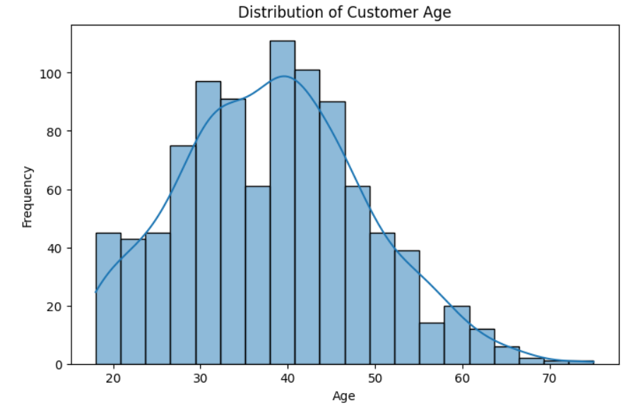
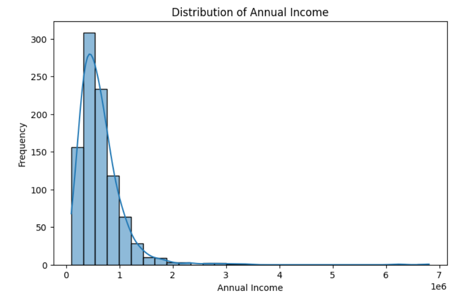
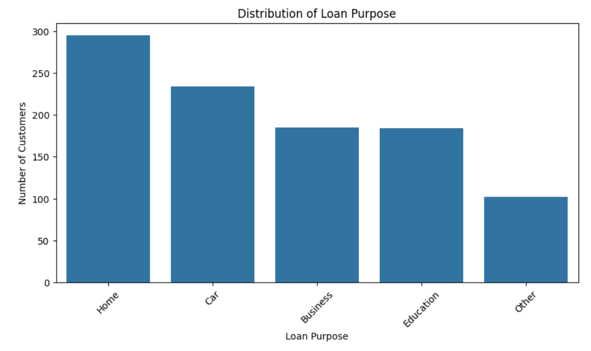
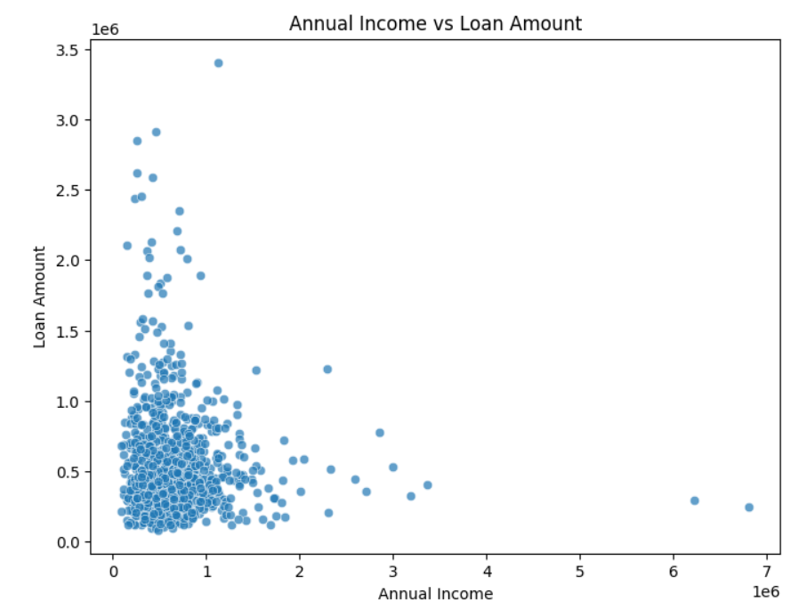
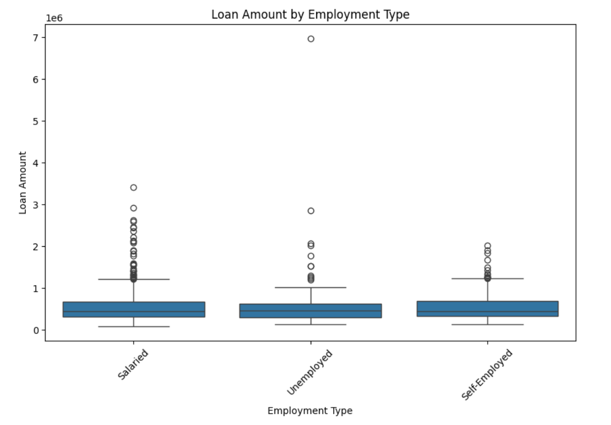
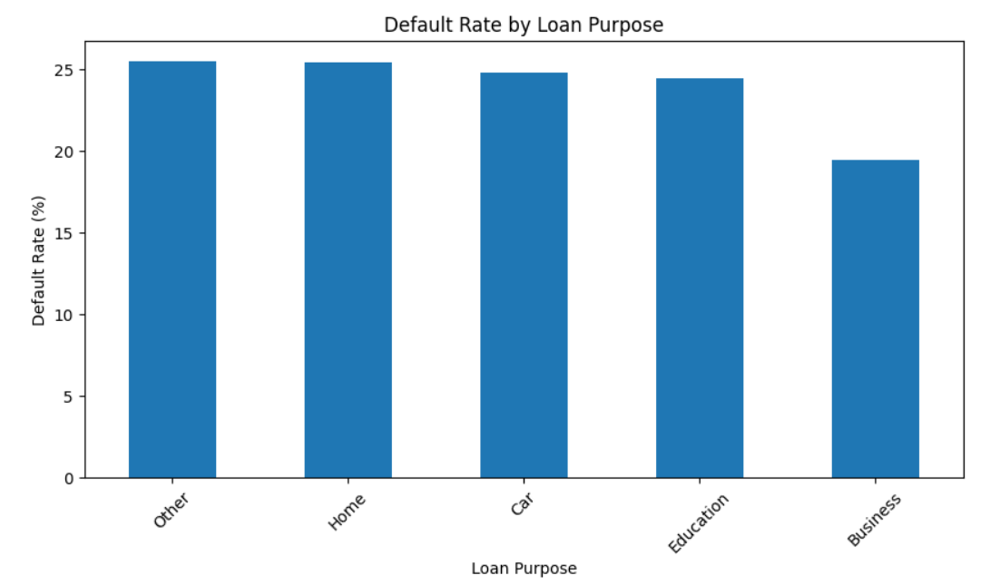
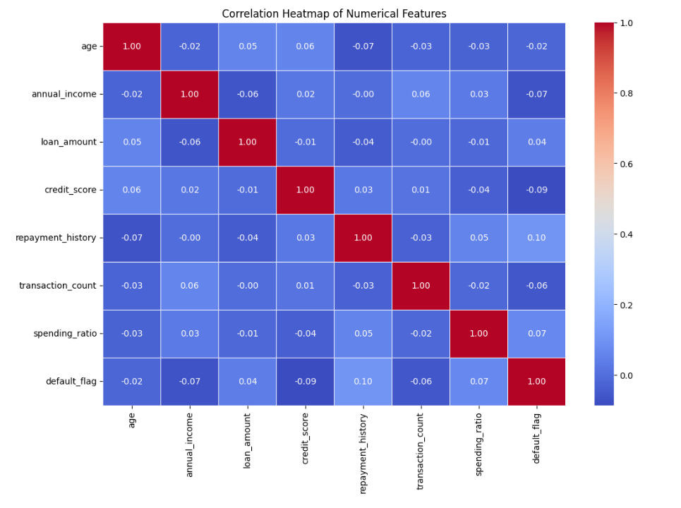
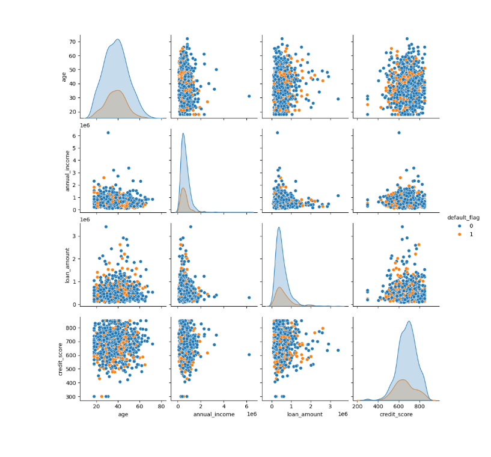

# 📊 Data Preprocessing & Feature Engineering

> **Customer Credit Risk Analytics — Holistic Data Preparer**

A complete, portfolio-ready data preprocessing and feature engineering project built around a **Customer Credit Risk** dataset. The workflow transforms raw customer/loan data into a clean, engineered, encoded, scaled dataset that is ready for machine-learning modeling.

## ✨ Project Overview

This project demonstrates an end-to-end data preparation workflow covering:

* 📥 Data acquisition
* 🔎 Data understanding & quality checks
* 🧹 Missing-value treatment
* 🚨 Outlier detection & treatment
* 🏷️ Categorical encoding
* 📦 Binning & discretization
* ⚖️ Feature scaling
* 🔄 Feature transformation
* 🛠️ Feature construction
* 🧩 `ColumnTransformer` & `Pipeline`
* ✅ Final dataset validation
* 💾 Export of a machine-learning-ready CSV

**Target variable:** `default_flag`

---

# 📸 Dashboard Preview

## 1️⃣ Customer Age Distribution


---

## 2️⃣ Annual Income Distribution


---

## 3️⃣ Loan Purpose Distribution


---

## 4️⃣ Annual Income vs Loan Amount


---

## 5️⃣ Loan Amount by Employment Type


---

## 6️⃣ Default Rate by Loan Purpose


---

## 7️⃣ Correlation Heatmap


---

## 8️⃣ Feature Relationship Pairplot
---
## 🎯 Objectives

The main goal is to build a reliable preprocessing workflow that:

1. Identifies data-quality issues before modeling.
2. Handles missing values using appropriate strategies.
3. Detects and reduces the impact of extreme observations.
4. Converts categorical information into model-friendly representations.
5. Creates meaningful business-oriented features.
6. Applies appropriate scaling and transformations.
7. Produces a clean dataset suitable for downstream machine-learning models.

## 📌 Dataset Snapshot

| Metric                  |     Value |
| ----------------------- | --------: |
| Original records        | **1,000** |
| Original columns        |    **15** |
| Original missing values |   **230** |
| Original duplicate rows |     **0** |
| Final records           | **1,000** |
| Final columns           |    **30** |
| Final missing values    |     **0** |
| Final duplicate rows    |     **0** |
| Non-default (`0`)       |   **760** |
| Default (`1`)           |   **240** |


## 🧭 Workflow

```text
Raw Customer Credit Risk Data
              ↓
      Data Acquisition
              ↓
    Data Understanding
              ↓
       Data Cleaning
       ├── Missing Values
       └── Duplicates
              ↓
      Outlier Treatment
              ↓
     Feature Engineering
       ├── Date Features
       ├── Ratios
       ├── Encoding
       └── Binning
              ↓
      Feature Scaling
              ↓
    Transformations
              ↓
 ColumnTransformer + Pipeline
              ↓
 Final Validation & Export
              ↓
Machine-Learning-Ready Dataset
```
## 📁 Recommended Repository Structure

```text
Holistic_Data_Preparer/
│
├── Holistic_Data_Preparer.ipynb
├── patient_health_records_cleaned.csv
├── final_cleaned_customer_credit_risk_dataset.csv
├── Holistic_Data_Preparer_Meet_mehta_12237
├── Holistic_Data_Preparer_theory.pdf
│
├── screenshots/
│   ├── ss_1
│   ├── ss_2
│   ├── ss_3
│   ├── ss_4
│   ├── ss_5
│   ├── ss_6
│   ├── ss_6
│   ├── ss_7
│   └── ss_8
│
└──README.md


## 🧹 Missing Value Handling

The project explores:

* Median Imputation
* Most Frequent Imputation
* Missing Indicators
* Random Sample Imputation
* KNN Imputation
* MICE / Iterative Imputation
* Complete Case Analysis

### Final strategy

* Numerical → **Median Imputation**
* Categorical → **Most Frequent Imputation**

The final workflow retains all **1,000 records** and produces **0 missing values**.

## 🚨 Outlier Handling

Four approaches are demonstrated:

| Method            | Purpose                                      |
| ----------------- | -------------------------------------------- |
| Z-Score           | Detect observations far from the mean        |
| IQR               | Identify observations outside IQR boundaries |
| Percentile Method | Detect extreme lower/upper observations      |
| Winsorization     | Reduce extreme-value influence               |

The analysis shows notable right-skew and extreme observations in **annual income** and **loan amount**, making robust preprocessing important.

## 🏷️ Feature Encoding

* **Ordinal Encoding** → `education_level`
* **Label Encoding** → `gender`
* **One-Hot Encoding** → `region`, `loan_purpose`

## 📦 Binning & Discretization

The project demonstrates:

* Equal-width binning
* Binarization
* Quantile binning
* K-Means binning

Example:

```text
annual_income ≤ ₹7,00,000 → 0
annual_income > ₹7,00,000 → 1
```

## 🛠️ Feature Engineering

### Debt-to-Income Ratio

```text
Debt-to-Income Ratio = Loan Amount / Annual Income
```

### Average Monthly Transactions

```text
Average Monthly Transactions = Transaction Count / 6
```

### Date Features

From `join_date`:

* `join_year`
* `join_month`
* `join_day`
* `join_weekday`

These engineered features provide additional information for machine-learning models.

## ⚖️ Feature Scaling

The project demonstrates:

* Standardization
* Normalization
* Min-Max Scaling
* MaxAbs Scaling
* Robust Scaling

The final numerical pipeline uses **Robust Scaling**, which is suitable when influential outliers are present.

## 🔄 Feature Transformations

The project demonstrates:

* Log Transformation
* Reciprocal Transformation
* Square Root Transformation
* Box-Cox Transformation
* Yeo-Johnson Transformation
* `FunctionTransformer`

## 🧩 Final Preprocessing Pipeline

### Numerical Pipeline

```text
Median Imputation
       ↓
Robust Scaling
```

### Categorical Pipeline

```text
Most-Frequent Imputation
       ↓
One-Hot Encoding
```

The final implementation uses Scikit-learn's `ColumnTransformer` and `Pipeline`.

## 📈 Exploratory Data Analysis

Visualizations include:

* Customer age distribution
* Annual income distribution
* Loan-purpose frequency
* Annual income vs. loan amount
* Loan amount by employment type
* Default rate by loan purpose
* Numerical correlation heatmap
* Feature pairplot grouped by `default_flag`

### Key observations

* Customer age is concentrated around the working-age population.
* Annual income is strongly right-skewed.
* Loan amounts contain notable extreme values.
* Loan purposes are unevenly distributed.
* Default rates vary across loan purposes.
* Most numerical variables show relatively weak pairwise linear correlations.
* Feature combinations, transformations and categorical variables may therefore provide additional predictive value.

## 📂 Repository Structure

```text
Data-Preprocessing-and-Feature-Engineering/
│
├── 📓 Holistic_Data_Preparer.ipynb
├── 📄 Holistic_Data_Preparer_theory.pdf
├── 📊 customer_credit_risk_dataset.csv
├── ✨ final_cleaned_customer_credit_risk_dataset.csv
├── 🖼️ dashboard.png
└── 📘 README.md
```

## 🧰 Tech Stack

| Tool                | Usage                       |
| ------------------- | --------------------------- |
| 🐍 Python           | Core programming            |
| 🐼 Pandas           | Data manipulation           |
| 🔢 NumPy            | Numerical operations        |
| 📊 Matplotlib       | Visualization               |
| 🎨 Seaborn          | Statistical visualization   |
| 🤖 Scikit-learn     | Preprocessing & pipelines   |
| 🗄️ SQLite          | SQL demonstration           |
| 📓 Jupyter Notebook | Development & documentation |

## ▶️ How to Run

### 1. Clone the repository

```bash
git clone <your-repository-url>
cd Data-Preprocessing-and-Feature-Engineering
```

### 2. Install dependencies

```bash
pip install pandas numpy matplotlib seaborn scikit-learn jupyter
```

### 3. Launch Jupyter

```bash
jupyter notebook
```

### 4. Open

```text
Holistic_Data_Preparer.ipynb
```

### 5. Run the notebook from top to bottom

Keep `customer_credit_risk_dataset.csv` in the same project directory.

## ✅ Final Validation

The final dataset was validated for:

* Missing values
* Duplicate rows
* Dataset shape
* Number of features
* Number of records
* Target distribution

### Final Result

```text
Records:        1,000
Columns:           30
Missing Values:     0
Duplicate Rows:    0
```

The exported dataset is:

```text
final_cleaned_customer_credit_risk_dataset.csv
```

## 💡 Why This Project Matters

This project demonstrates the complete transformation:

**Raw Data → Clean Data → Engineered Features → Encoded Data → Scaled Data → ML-Ready Dataset**

It shows how raw customer credit-risk data can be systematically prepared for predictive modeling.

## 🚀 Future Improvements

* 🤖 Train classification models for `default_flag`
* 📊 Compare Logistic Regression, Random Forest and Gradient Boosting
* 📈 Evaluate ROC-AUC, Precision, Recall and F1-score
* ⚖️ Investigate class imbalance
* 🔍 Add feature importance and explainability
* 🧪 Add automated preprocessing tests
* 🌐 Build an interactive Streamlit credit-risk dashboard

## 👨‍💻 Project Status

**Status:** ✅ Completed — Data Preprocessing & Feature Engineering

**Output:** Machine-learning-ready Customer Credit Risk dataset

---

# 👨‍💻 Author

## Meet Mehta

💻 Passionate about **Data Analytics, Python, Statistics, Machine Learning & Power BI**

📊 Interested in **Data Science, Artificial Intelligence, Business Intelligence, and Mathematical Computing**

🚀 Building real-world projects using **Python, SQL, Power BI, Excel, NumPy, Pandas, Matplotlib & SciPy**
---


⭐ **If you like this project, consider starring the repository!**
